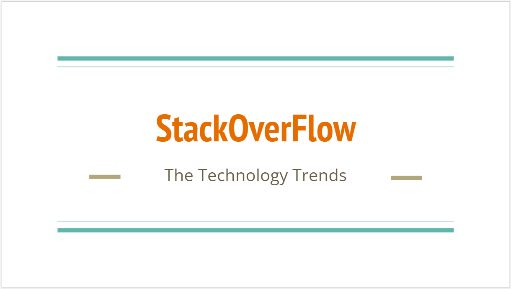

# StackOverFlow - The Technology Trends

ECE143 (Fall 2022) Course Project by: Murali Dandu, Raghu, Jon Carlo Bibat, Hao Qiu, Andy.



## About

StackOverFlow is a public platform building the definitive collection of coding questions & answers. It is a community-based space to find and contribute answers to technical concepts and tools.

We want to analyze this platform to understand the trends in different technologies, compare different statistics of the website like questions, answers etc. and deepdive into emerging and declining platforms.

Here are some of the research questions we tried to answer:
* How does StackOverFlow grow over the years?
* What are the key tags that constitute SOF and do they differ in QA statistics?
* What technologies declined and what have emerged over these years?
* What key terms constitute the Question titles?
* How are the main technology tags correlated with each other?
* What topics are usually associated with these main tags?

## Installation

Here are the requirements for running this streamlit application.
```
pandas
numpy
matplotlib
seaborn
scikit-learn
geopandas
wordcloud
```
As a recommended practice, you can create virtual environment and install the required packages in the following way
```
# Clone the repo
git clone https://github.com/murali-munna/stackoverflow-techtrends.git

# Create virtual env
conda create -n stackoverflow python=3.8 

# Activate the virual env
conda activate stackoverflow 

# cd into the root folder and install requirements
pip install requirements.txt
```
Run the python files:
```
python src/preprocess.py
python src/overall_trends.py
...
```

## Data

Public API to extract information on questions, answers, users and badges
* [GCP BigQuery](https://console.cloud.google.com/marketplace/product/stack-exchange/stack-overflow?project=arctic-surf-190506)

* Data available from 2008 till date

* Filtered and stratified sampled for 45+ tags with a total of 5.6M questions

* Tags are from the following main topics:
  * Programming Languages
  * Python Packages
  * Data Science fields
  * Big Data
  * Cloud
  * ML Ops


## Key Insights
* XX


-----


